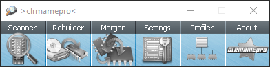

# Tutoriel Clrmamepro a supp

* [Définition des mots set; rom; romset; clone](https://github.com/Laddyacris/Wiki/wiki/Tutoriel-CLRMAMEPRO/_edit#définitions)   
* [Qu'est ce qu'un fichier dat](https://github.com/Laddyacris/Wiki/wiki/Tutoriel-CLRMAMEPRO#quest-ce-quun-fichier-dat-)  
* [Tableau des fichiers dat disponible pour les émulateurs arcade de recalboxOS](https://github.com/Laddyacris/Wiki/wiki/Tutoriel-CLRMAMEPRO#tableau-des-versions-disponibles-sur-recalbox-manque-la-version-de-rpi-jai-pas-parlé-de-imame4all-et-pifba) 
* [Les bios en arcade](https://github.com/Laddyacris/Wiki/wiki/Tutoriel-CLRMAMEPRO#les-bios-en-arcade-)  
* [Installer et Configuration CLRMamePro](https://github.com/Laddyacris/Wiki/wiki/Tutoriel-CLRMAMEPRO#clrmamepro-)   
* [Introduction rom parent, clone.](https://github.com/Laddyacris/Wiki/wiki/Tutoriel-CLRMAMEPRO#roms-parentes-et-roms-clone)
* [Explications non-merged set; split set; merged set](https://github.com/Laddyacris/Wiki/wiki/Tutoriel-CLRMAMEPRO#différence-entre-non-merged-set--split-set-merged-set)
* [Vérifier son romset : scanner](https://github.com/Laddyacris/Wiki/wiki/Tutoriel-CLRMAMEPRO#fonction-scanner--vérification-de-votre-romset)
* [Mise à jour de son romset : rebuild](https://github.com/Laddyacris/Wiki/wiki/Tutoriel-CLRMAMEPRO#fonction-rebuild--créer-votre-romset)
* [Séparer son romset en fonction d'un système \(neogeo\)](https://github.com/Laddyacris/Wiki/wiki/Tutoriel-CLRMAMEPRO#séparer-un-romset-en-fonction-de-son-système-bios)
* [Séparer un romset en parent-only](https://github.com/Laddyacris/Wiki/wiki/Tutoriel-CLRMAMEPRO#séparer-un-romset-complet-pour-obtenir-les-roms-parents-uniquement)
* [Créer un fichier dat à partir d'un dossier](https://github.com/Laddyacris/Wiki/wiki/Tutoriel-CLRMAMEPRO#créer-votre-fichier-dat-)      
* [Mettre à jour votre romset](https://github.com/Laddyacris/Wiki/wiki/Tutoriel-CLRMAMEPRO#mise-à-jour-de-votre-romset)

#### Définitions

* jeu \(game\) : indique le nom du jeu    
* set : chacun de versions de jeux   
* clone : version d'un jeu différent de l'original  
* rom : fichier contenu dans un set.
* rom set : ensemble de fichiers \(roms\) contenu dans un set   

Exemple :

#### Qu'est ce qu'un fichier dat ?

Les fichiers dat sont des fichiers textes avec des informations sur les jeux émulés avec une version spécifique de MAME.  
Dans ses fichiers dat, on trouve les informations pour des sets particuliers comme :  
nom de la rom \(name\), année \(year\), fabricant \(manufacturer\), information de fusion \(merge\), rom parent \(romof\) ou clone de \(cloneof\), taille de la rom \(size\), CRC pour chaque rom.  
CRC est un algorithme qui permet de vérifier l'intégrité d'un fichier, clrmamepro l'utilise pour vérifier vos rom-sets.

Exemple : A mettre

Entête indique des informations comme le nom de l'émulateur avec une description, la version et des informations sur l'auteur.

```markup
<datafile>
    <header>
        <name>MAME</name>
        <description>MAME 0.78</description>
        <category>EMULATION</category>
        <version>0.78</version>
        <date>-not specified-</date>
        <author>AntoPISA</author>
        <email>progettosnaps@gmail.com</email>
        <homepage>http://www.progettosnaps.net/</homepage>
        <url>-not specified-</url>
        <comment>-not specified-</comment>
        <clrmamepro/>
    </header>
```

Infomation rom

```text
mettre exemple moins long.
```

#### Tableau des versions disponibles sur Recalbox

manque la version de RPI j'ai pas parlé de imame4all et piFBA.

| Version | Emulateur | Core | Dat Files | Path | Bios | Compatibility list |
| :---: | :---: | :---: | :---: | :---: | :---: | :---: |
| 6.0 | Libretro | imame4all | [mame 0.37b5](https://github.com/recalbox/recalbox-buildroot/blob/rb-4.0.X/board/recalbox/fsoverlay/recalbox/share_init/roms/mame/clrmamepro/imame4all/imame4all.dat) | /recalbox/share/roms/mame | [Liste](https://github.com/Laddyacris/Wiki/wiki/Tutoriel-CLRMAMEPRO/_edit#les-bios-en-arcade-) |  |
| 6.0 | Libretro | Mame2003 | [mame 0.78 dat](https://github.com/recalbox/recalbox-buildroot/blob/rb-4.0.X/board/recalbox/fsoverlay/recalbox/share_init/roms/mame/clrmamepro/mame2003/mame2003.dat) | /recalbox/share/roms/mame | [Liste](https://github.com/Laddyacris/Wiki/wiki/Tutoriel-CLRMAMEPRO/_edit#les-bios-en-arcade-) |  |
| 6.0 | Libretro | Mame2003-plus | mame 0.78 + mame 0.188 | /recalbox/share/roms/mame | \[Liste\] |  |
| 6.0 | Libretro | Fba 0.2.97.44 | \[mame 0.189 dat\] | /recalbox/share/roms/fba\_libretro | [Liste](https://github.com/Laddyacris/Wiki/wiki/Tutoriel-CLRMAMEPRO/_edit#les-bios-en-arcade-) |  |
| 6.0 | Libretro | FBA 0.2.97.44 neogeo | \[mame 0.189 dat\] | /recalbox/share/roms/neogeo | neogeo.zip |  |
| 6.0 | Libretro | mame2003 neogeo | mame 0.78 dat | /recalbox/share/roms/neogeo | neogeo.zip |  |
| 6.0 | Standalone | piFBA | [mame 0.114 dat](https://raw.githubusercontent.com/digitalLumberjack/recalbox-os/master/wiki/dat/fba_029671_od_release_10_working_roms.dat) | /recalbox/share/roms/neogeo | [Liste](https://github.com/Laddyacris/Wiki/wiki/Tutoriel-CLRMAMEPRO/_edit#les-bios-en-arcade-) |  |
| 6.0 | Libretro | FBA 0.2.97.44 | \[mame 0.189 dat\] | /recalbox/share/roms/fba\_libretro | [Liste](https://github.com/Laddyacris/Wiki/wiki/Tutoriel-CLRMAMEPRO/_edit#les-bios-en-arcade-) |  |

/! Une rom arcade au format zip ne doit jamais être décompressé ou renommé. /!\  
Note : D'autres fichiers DATs sont disponible sur ce [site progretto-SNAPS Dats](http://www.progettosnaps.net/dats/) .

#### Les bios en arcade

Si vous avez récupérer votre romset, les bios pour certains éditeurs de jeux sont disponibles dans celui-ci. Voici la liste des bios présents dans votre romset qui sont nécessaire au fonctionnement de certaines roms.

| Nom | Editeurs | Nom bios |
| :---: | :---: | :---: |
| Acclaim PSX | Acclaim | acpsx.zip |
| Arcadia System BIOS | Arcadia Systems | ar\_bios.zip |
| Atari PSX | Atari | atpsx.zip |
| Atlus PSX | Atlus | atluspsx.zip |
| Baby Phoenix/GV System | Konami | konamigx.zip |
| Crystal System BIOS | BrezzaSoft | crysbios.zip |
| DECO Cassette System | Data East Corporation | decocass.zip |
| Hyper NeoGeo 64 Bios | SNK | hng64.zip |
| Max-A-Flex | Exidy | maxaflex.zip |
| Mega Play BIOS | Sega | megaplay.zip |
| Mega-Tech | Sega | megatech.zip |
| Multi Amenity Cassette System BIOS | I'Max | macsbios.zip |
| Neo-Geo | SNK | **neogeo.zip** |
| Nintendo Super System BIOS | Nintendo | nss.zip |
| PGM \(Polygame Master\) System BIOS | IGS | **pgm.zip** |
| PlayChoice-10 BIOS | Nintendo of America | **playch10.zip** |
| PS Arcade 95 | Eighting / Raizing | psarc95.zip |
| ST-V Bios | Sega | stvbios |
| Super Kaneko Nova System BIOS | Kaneko | **skns.zip** |
| System GX | Konami | **konamigx.zip** |
| Taito FX1 | Taito | taitofx1.zip |
| Taito GNET | Taito | taitogn.zip |
| TPS | Tecmo | tps.zip |
| ZN1 | Capcom | cpzn1.zip |
| ZN2 | Capcom | cpzn2.zip |

Source : [mamedb.com](http://www.mamedb.com/category/BIOS?start=20)  
**en gras : les bios obligatoires à avoir**

#### ClrmamePro

C'est un logiciel qui vous permet de vérifier, reconstruire vos romsets arcade en fonction d'un fichier d'information au format xml ou dat.

**Installation**

1. Télécharger ClrmamePro pour [windows](http://mamedev.emulab.it/clrmamepro/#downloads) ou pour [MacOS](http://www.emulab.it/), utiliser [Wine](https://doc.ubuntu-fr.org/wine).   

   Info : le fichier zip est une version portable.   

2. Installer le.
3. Récupérer le fichier dat de l’émulateur arcade souhaité.
4. Exécuter clrmamepro via un clic droit sur l’icône et choisir exécuter en tant qu'administrateur.   

/!\Astuce : Sous Windows, rendez vous sur l’exécutable cmpro64.exe ou cmpro32.exe , puis clic droit , choisir propriétés et aller dans l'onglet compatibilité puis cocher la case Exécuter en tant qu'administrateur. Valider par Ok. Le programme s’exécutera toujours en administrateur maintenant.

### Roms parentes et roms clone.

Il existe des jeux de "2 formats" différents que l'on appelle rom parente et rom clone. Un rom clone a besoin de la rom parent pour fonctionner.

Exemple : Jeu [metal slug 4](http://www.mamedb.com/list.php?fuzzy_name=metal+slug)

```text
Metal Slug 4 (NGH-2630)  (clone of: mslug4)          mslug4h.zip     
Metal Slug 4 (NGM-2630)                              mslug4.zip
```

mslug4.zip est la rom parente, mslug4h.zip est une rom clone. La rom clone est dépendante de celle.ci. Les noms de roms clones sont généralement suivie d'une lettre pour les différencier du nom de la rom parente.

#### Différence entre Non-Merged set , Split Set, Merged-Set.

Il existe 3 méthodes de répartition de roms pour gérer ces différentes versions d'un jeu :

* **Non Merged Sets** : chaque parent et chaque clone auront un zip à part entière contenant toutes les roms dont il a besoin. C'est de loin la méthode qui prend le plus d'espace sur le disque dur, mais vous n'avez plus à vous posez la question de savoir si les clones sont bien avec leurs parents lorsque vous gravez vos roms par exemple.    
* **Split Sets** : le set parent a un zip contenant toutes les roms dont il a besoin. Le\(s\) set\(s\) clone\(s\) a un zip qui ne contient que les roms différentes de celle du set parent. Toutefois, les sets clones auront besoin de certaines roms communes, contenues dans le zip parent, pour pouvoir fonctionner. Cette solution est celle qui prend le moins de place sur le disque dur, mais si les sets clones ne sont pas dans le même répertoire que celui des sets parents, ils ne fonctionneront pas.   
* **Merged Sets** : parents et clones d'un jeu seront contenus dans un seul gros zip. C'est une solution intermédiaire niveau place. Plus grosse qu'en split et moins qu'en not merged. Le problème de séparation parent/clone est aussi résolu. Le seul inconvénient reste pour mettre à jour ses roms si les clone ne vous intéressent pas.    

| Mode | Non-Merged | Split-Merged | Merged |
| :---: | :---: | :---: | :---: |
| parent | rom 1 nom : abcd crc : 1234 |  |  |
| clone 1 |  |  |  |
| clone 2 |  |  |  |

* Tableau à compléter.   

  Source [tuto Clrmamepro en fr détaillé](http://clrmamepro.free.fr/merger.php)

### Configuration CLRMAMEPRO



1. Création du profil.   

   Charger le fichier dat en cliquant sur le bouton **Add DatFile**    


1. Exemple fichier mame0.780.dat pour mame2003, choisir votre fichier dat.   

 Cliquer sur le bouton **Load/update**.  
Puis cliquer sur le bouton **default**, patientez pendant le scan, et une fenêtre s'ouvre cliquer sur OK ALL pour le laisser poursuivre.


1. Cliquer sur le bouton settings    

   Configuration **ROM-PATH** \(1\) qui indique le chemin vers la source de vos roms.   

   Cliquer sur le bouton **ADD** \(2\).    

   Une fois fait cliquez sur **Set as def** \(3\)  Valider par ok   


Configuration de ADD-PATH qui indique la dossier de destination de vos roms. Cliquer sur le bouton **ADD**.


Ferme la fenêtre.

Note : vous pouvez ajouter d'autres chemins vers les dossiers samples par exemple.

#### Fonction Scanner : Vérification de votre romset.

1. Cliquer sur le bouton Scanner 
2. Cocher set, roms, et samples si vous avez configurer les chemins \(1\)
3. Choisir l'option correspondant à votre romset non merged, split-merge, merged. \(2\)
4. Cliquer sur New Scanner.\(3\)   


#### Fonction Rebuild : créer votre romset.

Conseil : travailler toujours sur un copie de votre romset avant d'utiliser ce logiciel.

Exemple avec Mslug3 ^

```text
mslug3.zip rom parent
mslug3b6.zip clone de mslug3.zip
mslug3h.zip clone de mslug3.zip
mslug3v.zip clone de mslug3.zip
```

En admettant que vous ayez récupérer un romset **non-merged** c'est à dire qu'il contient les roms parents avec les roms clones. La fonction rebuild permet de changer le "mode" de votre romset. C'est à dire passer d'un romset non-merged à un romset merge ou split et vise et versa.

1. Cliquer sur le bouton scanner, Décocher samples, chd, et choisir Non-Merged Set, fermer la fenêtre en cliquant sur le croix en haut à droite. 
2. Cliquer sur Rebuild Indiquer la source de vos roms. Vérifier la destination. Choisir Non-Merged Set, décocher remove match source. Cliquer sur le bouton Rebuid.  Patientez ça peut être long.

### Séparer un romset en fonction de son système \(bios\) à partir d'un romset complet

Dans recalboxOS, nous avons séparé les roms arcade en 3 groupes : mame, fba\_libretro et neogeo.

Attention pour Neogeo par défaut, l'émulateur utilisé est fba\_libretro, si vous souhaitez utiliser mame 2003 il vous faudra modifier l'émulateur utilisé par défaut du système.  
Menu Emulationstation \(bouton start\) puis options jeux &gt; Avanced &gt; neogeo &gt; modifier les options souhaitées.

Pour séparer les roms neogeo contenu dans votre romset mame ou fba\_libretro, il suffit de lancer "Scanner" puis de cliquer sur le bouton **Systems**.

Le nombre de systèmes peut varier en fonction du fichier dat que vous avez chargé.

1. Cliquer sur le bouton AutoAssign - les systèmes sont assignés vers votre dossier de roms.   
2. Cliquer sur le bouton None, ça désélectionne tous les systèmes   
3. Cocher uniquement la case \[Bios\]Neo geo et choisir un dossier pour neogeo.   
4. Dans la zone Move Set to, indiquer un dossier pour vos roms neogeo.   


Vérifier votre dossier.

### Séparer un romset complet pour obtenir les roms parents uniquement.

Il vous suffit de créer un profil avec le fichier dat souhaité. Dans ce cas, mame2003\_parent\_only.dat \(avec ou sans neogeo à vous de voir\) .

* rom-path \(dossier contenant toutes vos roms\)   
* add samples-path \(si vous le souhaitez\)   
* Cocher la case MAKE backups To Folder et indiquer un dossier de backup.  


* Utiliser la fonction Scanner et configurer comme suit :  
  * Cliquer sur le bouton systems et cliquer sur le bouton Auto-assign.   
  * Cocher dans la partie check fix l'ensemble des cases.   
  * Pour accélérer le scan, décocher la case Ask before Fixing
  * Une fois fait, cliquer sur scan.   
  * Cliquer sur OK ALL si la question est posée pendant le scan.   

Et voila, consulter votre dossier source \(rom-path\) vous verrez que les roms **non indiqués** dans votre fichier dat, ont été déplacé dans votre dossier backup.  
Le dossier backup contient :

* à sa racine les roms modifiées par le scan qui n'étaient pas inscrites dans le fichier dat, et    
* un sous-répertoire nommé \_unknown avec les roms non modifiées par le scan qui n'étaient pas inscrites dans le fichier dat.

#### Créer votre fichier dat :

Vous avez vérifier votre romset avec clrmamepro via la fonction Scanner.  
Pour créer un fichier dat personnalisé vous pouvez utiliser le fonction **dir2dat** disponible dans le **Profil**.

Exemple : mame0.78\_neogeo\_only.dat

1. Indiquer le dossier \(1\)
2. Choisir le format xml \(2\)
3. Indiquer des informations \(3\)
4. Cliquer sur le bouton Create.\(4\)   


### Mise à jour de votre romset.

A. Prérequis :

* Avoir de multiples versions de romsets complets arcade  
* Avec éventuellement tous les Mame 0.xxx to 0.xxxx Update Pack 
* Télécharger le fichier dat adéquate souhaité \(voir tableau plus haut\)  
* Créer un nouveau profil avec le fichier dat téléchargé précédemment.    
* Faire une sauvegarde de vos romsets sur un disque dur externe, et toujours travailler sur une copie de votre romset à mettre à jour.   

B. Configuration

* rom-path \(le dossier source de vos roms   
* add-path \(ajouter tous les dossiers de romsets que vous possédez, plus il y en a mieux c'est
* sample-path \(ajouter le dossier samples de vos romsets\(optionnel car certains sets ont des samples manquants\)  
* Configurer un dossier de backup.   


C. Scanner votre romset

* Cocher les options suivantes comme sur la capture.  

     

Cliquer sur le bouton systems , puis sur Auto-Assign

Et enfin cliquer sur le bouton New Scanner, patientez ça peut être long.


D. Analyse des statistics.

Ce qui nous intéresse ici est la partie en haut **Missing**.  
Cette partie **Missing** vous indique les sets, roms, samples manquants.  
Je vous laisse relire les définitions plus haut.


Valider par Ok pour fermer la fenêtre, oui mais quelles sont les sets manquants.

Dans set information vous avez la liste des sets et roms manquantes.

 Pour obtenir une liste des sets manquants, il suffit de cliquer sur le bouton **Miss list** qui vous indiquera les sets manquants.


**Comment faire pour combler les sets manquants:**

Avec le nom indiqué dans le fichier vous pouvez rechercher les sets manquants sur différents moteurs de recherche avec les mots clés suivants : mame nomdufichier.zip

Exemple : Il s agit du jeu Touch & Go \(touchgo.zip\) avec ces clones.

```text
touchgo
touchgoe
touchgok
touchgon
```

Il y a fort à parier que vous tombiez sur des sites proposant les archives manquantes.  
Récupérer les et placer dans un dossier nommé missing par exemple.  
Une fois tous les sets manquants récupérés , ajouter le dossier dans la partie settings &gt; add-path. Relancer un scan. Si tout va bien vous aurez diminuer vos sets manquants.  
Recommencer autant de fois que nécessaire si il vous en manque.

**Combler les roms manquantes :**

C'est la partie la plus longue et fastidieuse pour reconstituer vos romsets complets. Pour plus de facilité, exporter la liste des roms manquantes.

Analyse d'une rom manquante

```text
Burger Time (Data East USA) [graphics issues, use parent romset!] [folder: btime3 - parent: btime - size: 56kb]
missing rom: ab03-3.6b [size: 2048] [CRC32: f699d797]
missing rom: ab04-3.9b [size: 4096] [CRC32: 5d90c696]
missing rom: ab05-3.10b [size: 4096] [CRC32: c2b44b7f]
missing rom: ab05a-3.12b [size: 4096] [CRC32: 12e9f58c]
missing rom: ab06-3.13b [size: 4096] [CRC32: e0b993ad]
missing rom: ab07-3.15b [size: 4096] [CRC32: 91986594]
```

* **Burger Time \(Data East USA\)** : nom du set    
* **\[graphics issues, use parent romset!\]** : il s'agit d'un clone btime3.zip avec des problèmes graphiques, il est conseillé d'utiliser la rom parent btime.zip.   
* **\[folder: btime3 - parent: btime - size: 56kb\]** :  rappelez vous  plus haut je vous disais que les roms clone étaient toujours accompagnées d'un chiffre ou lettre.   

  Ici il s'agit d un clone btime3.zip. et sa rom parente est btime.zip

* **missing rom: ab03-3.6b** : information sur le fichier \(rom\) manquant dans l'archive   
* **\[size: 2048\] \[CRC32: f699d797\]** : information sur la taille/poids de ce fichier avec la signature CRC pour identifier.   

En utilisant les informations suivantes dans votre moteur de recherche préféré : **ab03-3.6b CRC32: f699d797**  
Il est fort possible que vous trouviez votre rom manquante, il suffit de refaire la recherche sur les autres fichiers. Ils peuvent ou non être contenu déjà dans l'archive récupérée. Récupérer vos fichiers manquants que vous placerez dans un dossier missing comme précédemment.  
Une fois terminée , ne pas oublier d'ajouter le dossier dans **settings &gt; add-path**.  
Relancer une nouvelle fois votre scan autant de fois que vous voulez.

A la fin vous devez obtenir ceci :


Pour obtenir un fichier contenant les roms manquantes, il suffit dans la fenêtre Set information de faire un clic droit sur celle-ci et de choisir **Copy to Clipboard &gt; all list sets messages**. Ouvrir le bloc-note et coller le résultat.

Note :  
déplacer `https://github.com/recalbox/recalbox-buildroot/blob/rb-4.0.X/board/recalbox/fsoverlay/recalbox/share_init/roms/fba_libretro/FBA_libretro_NEOGEO_only.dat`  
dans le dossier `/recalbox/share_int/roms/neogeo/date file/FBA_libretro_NEOGEO_only.dat` et ajouter celle de mame2003 neogeo.

Réaliser Une PR avec les dats manquants.

Remerciements : Source :  
Consulter :

#### Travaux : Option set informations

Après configuration de clrmamepro, lancer le scan de votre romset.  
Une fenêtre nommé set information apparaît.  
Cliquer sur le bouton set information  
Pour créer un fichier dat contenant uniquement les roms parentes  
Cliquer sur le bouton avail.sets  
Décocher les cases clones et parent si cochées  
Entrer les informations suivantes: `%c=?*`  
Vous remarquerez que seuls les clones sont sélectionnés  
Cliquez sur le bouton invert ; la sélection est inversée et maintenant les roms parentes sont sélectionnées  
Cliquez sur le bouton export ; donner un nom à votre fichier dat \(mame2003\_parent\_only\)

#### \[WIP\] Télécharger les fichiers dat à partir de clrmamepro : www Mode

WWW Mode est un gestionnaire de téléchargements de fichiers dat.

* Ouvrir le logiciel clrmamepro
* Non obligatoire mais vous pouvez déjà créer votre dossier pour un profil \(exemple : mame 2003\) en faisant un clic droit sur \[PROFILES\] &gt; Create folder.  
* Cliquer sur le bouton WWW Mode   
* Cliquer sur le bouton Add Site...   
  * URL of Dat : mamedl.esy.es/dats/cmdats/recalbox\_arcade.zip   
  * Site Alias : Recalbox \(par exemple\)   
* Valider par OK Vous obtenez une liste de différentes fichiers dats disponibles. 
* Clic droit sur le fichier, choisir Download File ou double clic sur le fichier ou cliquer sur le bouton download.
* Vous pouvez créer un dossier ou non en cliquant sur Create Dir si vous ne l'avez pas fait avant.   
* Sélectionner votre dossier puis cliquer sur OK.  
* Cliquer sur oui pour ouvrir le profil avec le fichier dat fraîchement téléchargé.   
* Cliquer sur Default Passer à la configuration \(settings\) de votre profil.   

